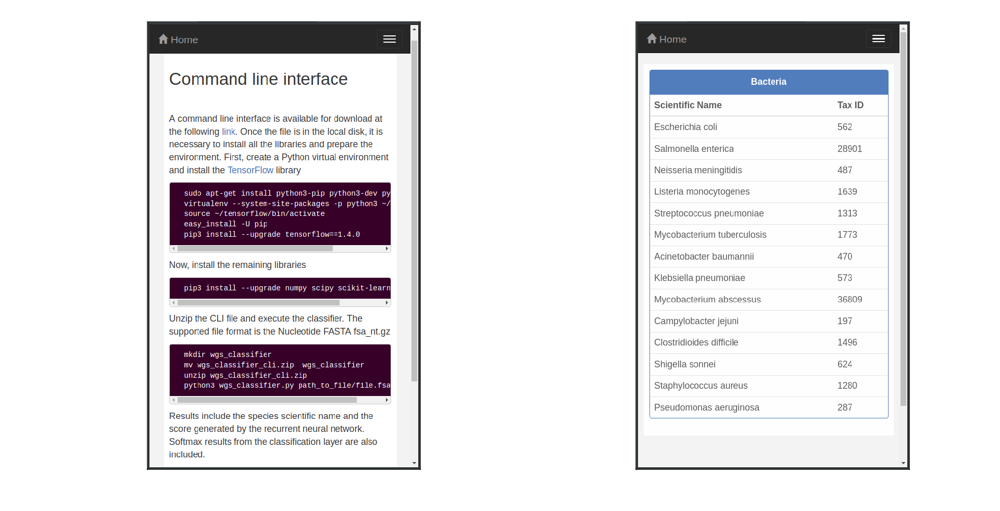

# Bacteria identification using whole genome sequences

The identification of bacteria plays an essential role in multiple areas of research. Those areas include experimental biology, food and water industries, pathology, microbiology, and evolutionary studies. Machine learning, an area of artificial intelligence, has the ability to analyze high dimensional data in a systematic, fast, and efficient way. Therefore, we propose a sequential deep learning model for bacteria classification. 

The proposed neural network exploits the vast amounts of information generated by Next Generation Sequencing, in order to extract a classification model for whole genome bacteria sequences. A distributed representation based on k-mers of k={3,4,5} provided an efficient encoding for the bacterial sequences. The classification model relies on a bidirectional recurrent neural network architecture. It generates an accuracy of 0.99455 +/- 0.00281 for 14 species, 0.95031 +/- 0.00469 for 48 species, and 0.89107 +/- 0.00392 for 111 species. Check the [Docker Hub][1] page of the project for a complete list of bacterial species.


## Installation 

[TensorFlow](https://www.tensorflow.org/install/pip) installation page has instructions for different setups. We cover instructions considering a CPU-based installation for TensorFlow on Ubuntu

```bash
sudo apt-get update
sudo apt-get install -y python3-pip python3-dev python3-tk
sudo pip3 install -U virtualenv
```

Create a virtual enviornment and activate it
```bash
virtualenv --system-site-packages -p python3 ~/tfcpu
source ~/tfcpu/bin/activate 
```

Install Python packages
```bash
pip3 install --upgrade pip
pip3 install --upgrade tensorflow==1.6.0
pip3 install --upgrade numpy scipy scikit-learn matplotlib Flask==1.0.2
```

Now we are ready to clone the repository
```bash
git clone https://github.com/lelugom/wgs_classifier.git
```

Run the command line interface
```bash
python3 wgs_classifier.py compressed_fasta_file.fsa_nt.gz
```

Or load the web application and access it at http://localhost:5000
```bash
python3 server.py
```

A Docker container with all the files and dependencies is available at [Docker Hub][1]. The repository has instructions to start a container and easily access the model through the web interface.

## User interface 
There are four views for the web application, which was built using the [React](https://reactjs.org/) JavaScript library and the [Flask](http://flask.pocoo.org/) microframework




Upload a bacterial nucleotide FASTA file on the Bacteria Classification view by clicking on the `Choose file` button. Then, click on the `Process sequence` button. Once the file is processed and the model generates the prediction, the resulting species and the score from the softmax layer appear on the bottom part of the page. Instructions to install and use the model from the command line, especially for batch operations, are also included. For reference, the web application includes a table with the scientific names and taxonomy IDs for the bacterial species supported by the model.

## Replication of results
To easily replicate metrics, the file datasets/test_dataset.csv has a small dataset with k-mers representations for bacterial whole genome sequences. Run the command below to load the test dataset and compute the metrics from the trained model
```bash
python3 wgs_rnn_test.py
```

Results should contain accuracy, precision, recall, and F-score for the test dataset. Here is an example output
```bash
Test results

	accuracy  :  0.89671   
	precision :  0.89632   
	recall    :  0.89671   
	fscore    :  0.88602
```

## License
This project is licensed under the terms of the [MIT](https://opensource.org/licenses/MIT) license.

[1]: https://hub.docker.com/r/lelugom/wgs_classifier